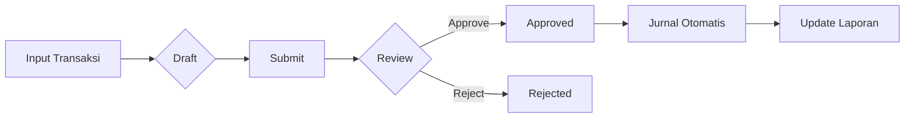

# Sistem Inventaris & Keuangan BUMDes Somogede

Aplikasi web untuk mengelola inventaris dan keuangan Badan Usaha Milik Desa (BUMDes) Somogede. Dibangun menggunakan Laravel dengan antarmuka modern dan fitur lengkap untuk kebutuhan akuntansi desa.

## 📋 Daftar Isi

- [Fitur Utama](#fitur-utama)
- [Arsitektur Aplikasi](#arsitektur-aplikasi)
- [Alur Kerja](#alur-kerja)
- [Modul Aplikasi](#modul-aplikasi)
- [Instalasi](#instalasi)
- [Penggunaan](#penggunaan)

## 🚀 Fitur Utama

| Modul | Deskripsi |
|-------|-----------|
| **Dashboard** | Statistik keuangan, grafik tren, dan ringkasan aktivitas terkini |
| **Manajemen Kas** | Pencatatan transaksi kas masuk/keluar dengan sistem approval |
| **Pendapatan** | Pencatatan semua sumber pendapatan unit usaha |
| **Pengeluaran** | Pencatatan dan approval pengeluaran operasional |
| **Piutang** | Pelacakan piutang pelanggan dengan aging report |
| **Hutang** | Manajemen kewajiban kepada supplier |
| **Aset** | Inventarisasi aset tetap dengan depresiasi otomatis |
| **Unit Usaha** | Pengelolaan multiple unit bisnis BUMDes |
| **Daftar Akun** | Chart of Accounts sesuai standar akuntansi |
| **Jurnal Umum** | Pencatatan jurnal dengan double-entry |
| **Anggaran** | Perencanaan dan kontrol anggaran |
| **Laporan** | Laporan keuangan (Laba Rugi, Neraca, Arus Kas) |

## 🏗️ Arsitektur Aplikasi

```
┌─────────────────────────────────────────────────────────────┐
│                      PRESENTASI                              │
│  ┌─────────────┐  ┌─────────────┐  ┌─────────────┐          │
│  │   Blade     │  │   Layout    │  │ Components  │          │
│  │   Views     │  │   Admin     │  │  Reusable   │          │
│  └─────────────┘  └─────────────┘  └─────────────┘          │
└─────────────────────────────────────────────────────────────┘
                            │
┌─────────────────────────────────────────────────────────────┐
│                      CONTROLLER                              │
│  Dashboard │ Cash │ Income │ Expense │ Report │ dll        │
└─────────────────────────────────────────────────────────────┘
                            │
┌─────────────────────────────────────────────────────────────┐
│                       SERVICE                                │
│  ┌─────────────────────────────────────────────────────┐    │
│  │                  JournalService                      │    │
│  │   - Membuat jurnal otomatis dari transaksi          │    │
│  │   - Sinkronisasi dengan Chart of Accounts           │    │
│  └─────────────────────────────────────────────────────┘    │
└─────────────────────────────────────────────────────────────┘
                            │
┌─────────────────────────────────────────────────────────────┐
│                        MODEL                                 │
│  User │ BusinessUnit │ Journal │ ChartOfAccount │ dll      │
└─────────────────────────────────────────────────────────────┘
                            │
┌─────────────────────────────────────────────────────────────┐
│                      DATABASE (MySQL)                        │
└─────────────────────────────────────────────────────────────┘
```

## 🔄 Alur Kerja

### 1. Alur Transaksi Umum



### 2. Sistem Approval

Transaksi melalui workflow persetujuan bertingkat:

| Status | Warna | Keterangan |
|--------|-------|------------|
| `draft` | 🟡 Kuning | Baru dibuat, bisa diedit |
| `pending` | 🔵 Biru | Menunggu persetujuan |
| `approved` | 🟢 Hijau | Disetujui, masuk jurnal |
| `rejected` | 🔴 Merah | Ditolak, perlu revisi |

### 3. Sinkronisasi Jurnal

Setiap transaksi yang **approved** otomatis membuat jurnal:

```
Contoh: Transaksi Pendapatan Rp 1.000.000

Jurnal Otomatis:
┌─────────────────────────────────────────────────┐
│ Debit  : Kas                    Rp 1.000.000   │
│ Kredit : Pendapatan Usaha       Rp 1.000.000   │
└─────────────────────────────────────────────────┘
```

## 📦 Modul Aplikasi

### Manajemen Kas (`/cash`)
- Mencatat transaksi kas harian
- Laporan kas harian
- Rekonsiliasi saldo

### Pendapatan (`/income`)
- Input sumber pendapatan
- Kategori pendapatan per unit usaha
- Tracking status pembayaran

### Pengeluaran (`/expense`)
- Pencatatan pengeluaran operasional
- Approval bertingkat
- Bukti transaksi (upload)

### Piutang (`/receivable`)
- Catat piutang pelanggan
- Pembayaran cicilan
- **Aging Report**: Analisis umur piutang

### Hutang (`/payable`)
- Manajemen kewajiban ke supplier
- Jadwal pembayaran
- Tracking jatuh tempo

### Aset (`/asset`)
- Inventarisasi aset tetap
- Kategori aset
- Perhitungan depresiasi
- Disposal aset

### Unit Usaha (`/business-unit`)
- Multi unit bisnis
- Laporan terpisah per unit
- Aktivasi/nonaktif unit

### Daftar Akun (`/chart-of-account`)
- Chart of Accounts lengkap
- Tipe: Aset, Liabilitas, Ekuitas, Pendapatan, Beban
- Kode akun terstruktur

### Jurnal Umum (`/journal`)
- Double-entry bookkeeping
- Jurnal manual & otomatis
- Approval jurnal

### Anggaran (`/budget`)
- Perencanaan anggaran tahunan
- Item anggaran detail
- Monitoring realisasi

### Laporan (`/report`)
- **Laporan Laba Rugi**: Pendapatan vs Beban
- **Neraca**: Posisi keuangan
- **Arus Kas**: Cash flow statement
- **Buku Besar**: Detail per akun
- **Neraca Saldo**: Trial balance
- Export: PDF & Excel

## ⚙️ Instalasi

### Prasyarat
- PHP >= 8.1
- Composer
- MySQL / MariaDB
- Node.js & NPM

### Langkah Instalasi

```bash
# 1. Clone repository
git clone [repository-url]
cd inventaris-bumdes-somogede

# 2. Install dependencies
composer install
npm install

# 3. Setup environment
cp .env.example .env
php artisan key:generate

# 4. Konfigurasi database di .env
# DB_DATABASE=bumdes_somogede
# DB_USERNAME=root
# DB_PASSWORD=

# 5. Migrasi & seeder
php artisan migrate --seed

# 6. Build assets
npm run build

# 7. Jalankan server
php artisan serve
```

## 📖 Penggunaan

### Role Pengguna

| Role | Hak Akses |
|------|-----------|
| **Direktur** | Full access + manajemen user |
| **Bendahara** | Transaksi keuangan + approval |
| **Staff** | Input transaksi dasar |

### Login Default

```
Email    : admin@bumdes.test
Password : password
```

### Workflow Harian

1. **Login** ke sistem
2. **Input transaksi** harian (kas, pendapatan, pengeluaran)
3. **Submit** transaksi untuk approval
4. **Approve/Reject** oleh pejabat berwenang
5. **Cek laporan** untuk monitoring keuangan

## 🛡️ Keamanan

- Autentikasi berbasis session
- Role-based access control
- Rate limiting untuk login
- Honeypot protection
- CSRF protection

## 📝 Lisensi

MIT License - Bebas digunakan untuk keperluan BUMDes.

---

**Dikembangkan untuk BUMDes Somogede** 🏘️
